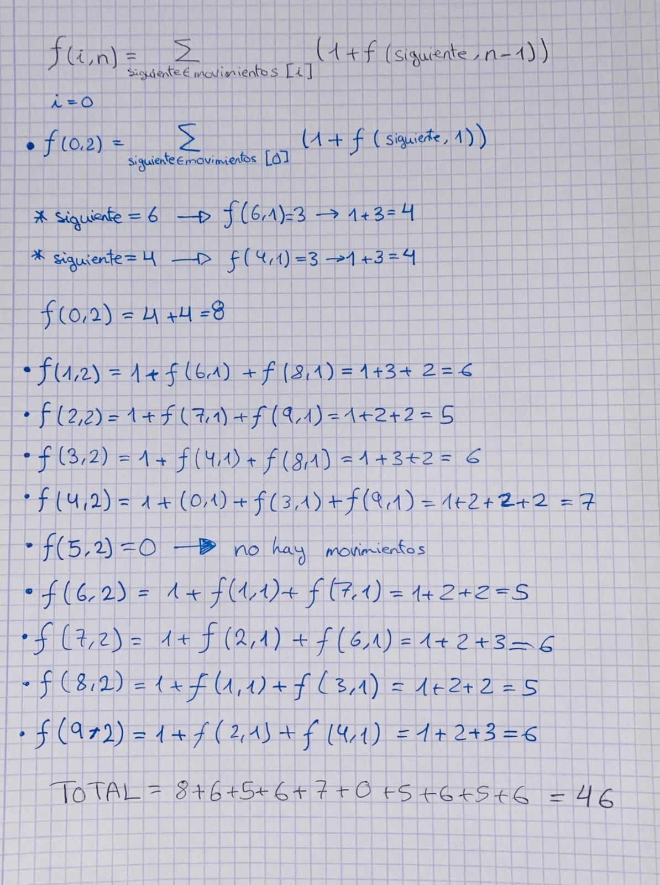

# Práctica-2

[Link del Repositorio](https://github.com/flavi13/Pr-ctica-2.git)

## Solucion

| Nº pasos | Simulacion        |
|----------|-------------------|
| 1        | 20                |
| 2        | 46                |
| 3        | 104               |
| 5        | 544               |
| 8        | 6576              |
| 10       | 34432             |
| 15       | 2140672           |
| 18       | 25881088          |
| 21       | 307302400         |
| 23       | 1609056256        |
| 32       | 2792668987392     |

### Primera aproximacion (Codigo)
Para plantear mejor el problema y verlo desde una prespectiva diferente al papel, lo primero que hemos hecho ha sido crear un algoritmo recursivo que simula los movimientos del caballo.

[simulation.py](codigo/simulation.py)

Como los resultados coinciden con la muestra del enunciado. Hemos asumido que tenemos el algoritmo en codigo

### Resolucion Matematica

### Comprobacion Manual

